# Manual de usuario :iphone:

**Tabla de contenidos**

- [Manual de usuario :iphone:](#manual-de-usuario-iphone)
- [Descripción](#descripción)
- [Tecnologías usadas](#tecnologías-usadas)
- [Uso](#uso)
- [Estado del proyecto](#estado-del-proyecto)

# Descripción

Bienvenido al manual de usuario de LeishmaniApp, una aplicación de apoyo diagnóstico de la Leishmaniasis y otras enfermedades parasitarias, LeishmaniApp se compone de tres elementos principales que trabajan conjuntamente para conformar una herramienta de diagnóstico para especialistas
como parte de un proyecto marco denominado "_Inteligencia artificial para apoyo en el diagnóstico de leishmaniasis cutánea_".
LeishmaniApp cuenta con un modelo de detección de mácrofagos alojado en una arquitectura de procesamiento en nube AWS, al cual se conecta a
una aplicación móvil que permite al usuario tomar desde el dispositivo imágenes de microscopía para ser analizadas.
La aplicación también cuenta con un módulo de gestión de pacientes a quienes se le realicen análisis y con un módulo de exportación e importación de modo que la información recolectada en la base de datos de la aplicación pueda ser distribuida a quien interese (laboratorios y/o especialistas).

# Tecnologías usadas
El stack tecnológico usado en este proyecto es

***Aplicación***
* Android versión 8.1 API 27
* Jetpack Compose
* Jetpack Room (SQLite3)
* Jetpack Startup
* Jetpack LiveData
* Jetpack ViewModel
* Jetpack WorkManager
* Jetpack Navigation
* Jetpack Hilt
* Jetpack CameraX
* KotlinX
* AWS Amplify
  
***Arquitectura en nube***
* DynamoDB
* S3
* Lambda
* Cognito
* API Gateway
* SQS/SNS
* Step Functions
* ECR

  
***Módelo de detección de macrófagos***
* OpenCV
* Python 3.9

# Uso
A continuación, se describe un tutorial de las funciones de la aplicación y su navegabilidad

***Inicio***

1. Presione en comenzar

2. Autenticarse con las credenciales dadas por el INS (Instituto Nacional de Salud)
   

3. Seleccionar la enfermedad a diagnosticar

4. Menú principal de la aplicación con la enfermedad seleccionada y sus módulos

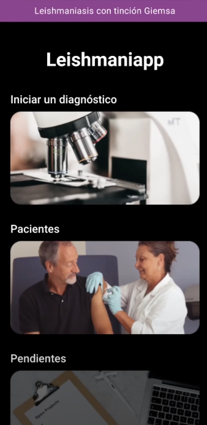

***Pacientes*** :frowning_person: :frowning_man:
1. Cuando se elige la opción de pacientes, la aplicación redirige a la lista de pacientes regitsrados en la aplicación.
   En la barra de búsqueda filtre el paciente que requiera por su número de cédula
   Si desea agregar un nuevo paciente, presione el icono de __más__ junto a la barra de búsqueda

      _Si la lista de pacientes está vacía, le dará la opción de agregar un paciente_
   

2. Para agregar un paciente debe ingresar su nombre, tipo de documento de identidad y número de documento de identidad,
 luego presione en _crear paciente_

3. Para ver la lista de informes de diagnóstico asociados a un paciente, seleccionelo de la lista de pacientes. También podrá iniciar un diagnóstico desde allí
   
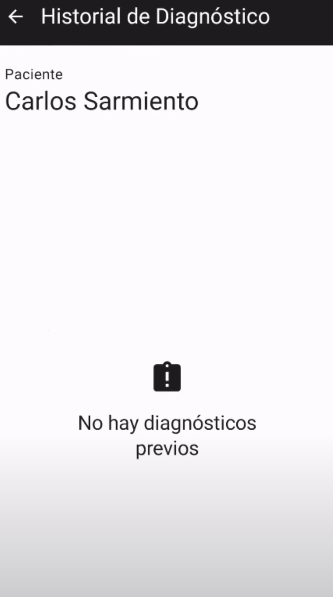

***Diagnóstico*** :camera:
1. Luego de haber presionado en el menú principal _iniciar diagnóstico_, la aplicación se dirige a lista de pacientes para asociar un paciente
   al análisis y abre la cámara para tomar la primera fotografía a analizar
   
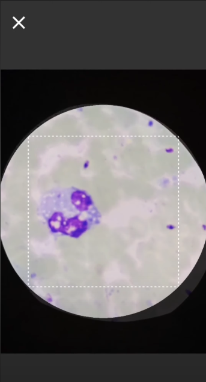

2. Cuando la fotografía ha sido tomada, se observa una pantalla con la imagen,
   el nombre del paciente asociado y el número de campo de la imagen. Aquí puede

   - Repetir la imagen: Puede volver a repetir la fotografía
   - Analizar la imagen: Enviar la imagén a procesar
   - Ver los resultados: Tabla de resultados del análisis de la fotografía por el modelo y el especialista
   - Finalizar toma de imágenes: Finalizar la toma de imágenes
     
  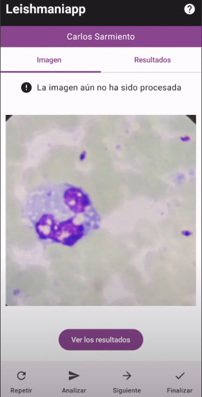
  - Tabla de resultados
      Debe ingresar los resultados del especialista y esperar a que el módelo de sus resultados. De lo contrario, no podrá continuar con el diagnóstico
    
   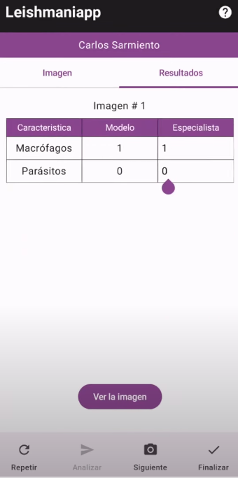

3. Una vez el modelo haya respondido, se marcará una _X_ con el centro de masa de/los macrófagos detectados.
   Podrá editar las respuestas del módelo de diagnóstico al presionar _editar la imagen_

   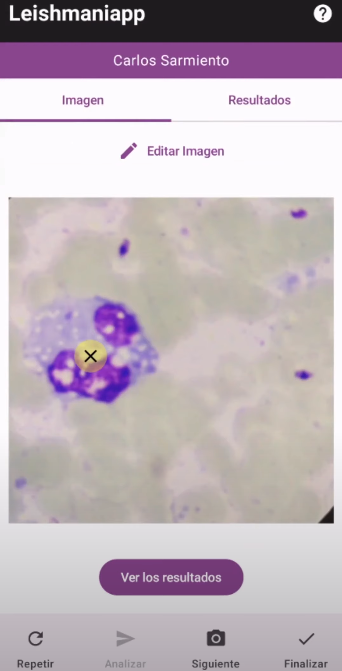

4. Podrá desmarcar los macrófagos encontrados por el módelo y eliminarlos o descartas los cambios

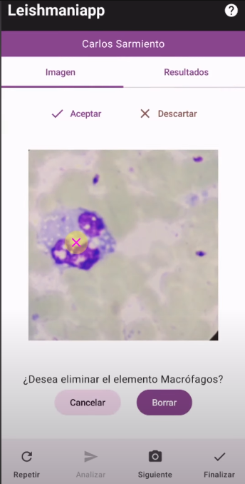

5. Podrá tomar cuantas imágenes decida hasta que presione finalizar, donde podrá ver un resumen de las imágenes tomadas para ese análisis de diagnóstico

6. Cuando haya finalizado el diagnóstico definitivamente, podrá realizar observaciones a cerca del análisis hecho

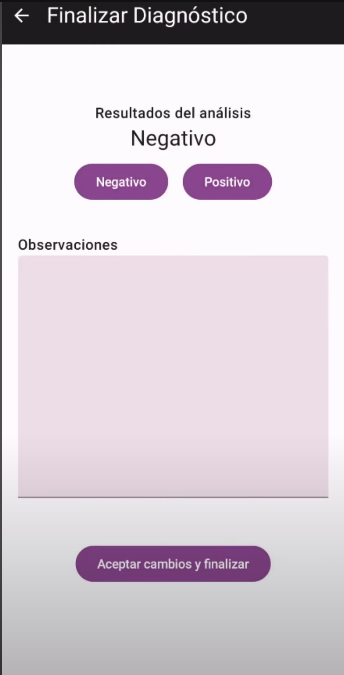
  
7. Luego de ingresar las observaciones y aceptar los cambios, podrá visualizar el informe d e diagnóstico final
   Aquí, podrá compartir el informe a través de formato PDF a otras aplicaciones

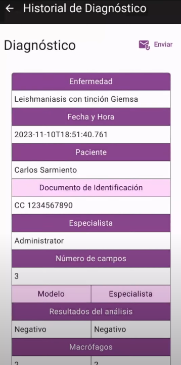

***Pendientes***
1. Si el análisis es realizado bajo malas condiciones de internet, la aplicación permitirá seguir tomando fotografías
 e irá encolando las imágenes par analizarlas cuando detecte internet

2. Al finalizar el diagnóstico, la aplicación solicitará procesar las imagénes en segundo plano 

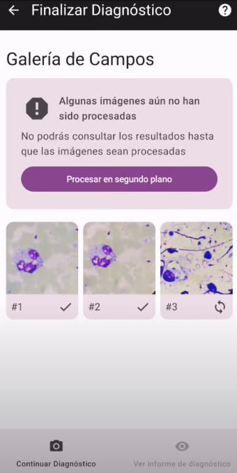

3. Para verificar el estado del diagnóstico, en el menú principal ingresar a la sección de pendientes. Aquí, se visualiza la lista de diagnósticos,
su estado y un botón de sincronizar que permite actualizar los cambios si se ha detectado internet y se han analizado imágenes

4. Para acceder a los detalles de cada diagnóstico en la lista de pendientes, seleccionar uno
Dentro del detalle, podrá verificar las imágenes analizadas y editarlas

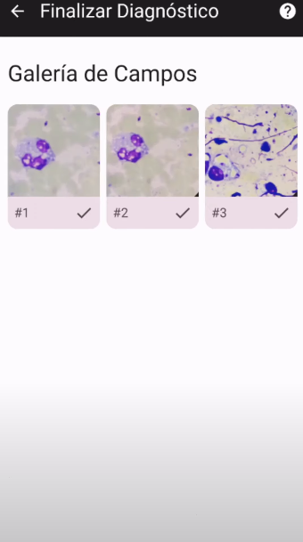

***Exportación e importación***

1. Aquí podrá exportar la base de datos de la aplicación como archivo .SQLite o importar una exportada desde otro dispositivo

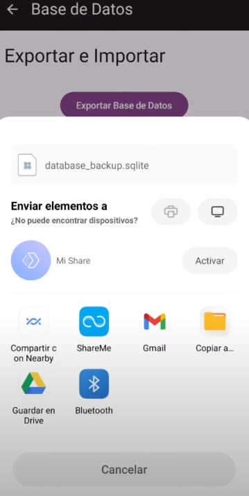

 # Estado del proyecto 

:construction: _Proyecto en construcción_ :construction:

Como se menciona en la descripción, esta es una aplicación bajo un proyecto marco del instituto nacional de salud que sigue en construcción.
Se proyecta la detección de parasitos de Leishmaniasis y agregar otras enfermedades parasitarias a la aplicación
- El presente proyecto der grado garantiza la extensibilidad de la arquitectura de la aplicación para trabajos futuros

